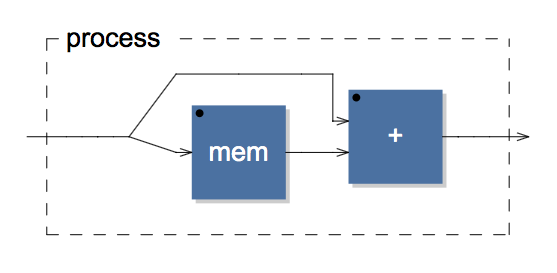
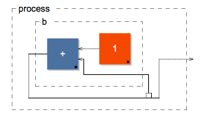

class: inverse

# functional composition across multiple time scales
[with surprise lisp]

.footnote[[antoine@artifactual.org.za](mailto:antoine@artifactual.org.za)]

---

class: black, middle

--

.footnote[[Hasegawa Tohaku "Pine Trees"](https://en.wikipedia.org/wiki/File:Hasegawa_Tohaku,_Pine_Trees.jpg)]

---

# 間

間 is a Japanese word which can be roughly translated as *gap*, *space*, *pause* or *the space between two structural parts.*

--

間 is not something created by compositional elements; *it is the thing that takes place in the imagination of the human who experiences these elements.*

.footnote[[間](https://en.wikipedia.org/wiki/Ma_&#40;negative_space&#41;)]

---

# Frege's principle

## *"the meaning of a complex expression is determined by the meanings of its constituent expressions and the rules used to combine them"*

--

The principle of compositionality states that in a meaningful sentence, if the lexical parts are taken out of the sentence, what remains will be the rules of composition. 

--

**For example:** The sentence "Socrates was a man":

--

Once the meaningful lexical items are taken away—"Socrates" and "man" - what is left is the pseudo-sentence: *"S was a M"*

--

**The task then becomes a matter of describing what the connection is between S and M.**

---

## "Can Programming Be Liberated From the von Neumann Style?"

### John Backus, 1977 Turing Award lecture

> *"Conventional programming languages are growing ever more enormous,
> but not stronger. Inherent defects at the most basic level cause them
> to be both fat and weak:*
>
> *their primitive word-at-a-time style of
> programming inherited from their common ancestor--the von Neumann
> computer,*
>
> *their close coupling of semantics to state transitions,
> their division of programming into a world of expressions and a world
> of statements,*
>
> *their inability to effectively use powerful combining
> forms for building new programs from existing ones,*
>
> *...and their lack of useful mathematical properties for reasoning about programs."*

.footnote[[http://www.webcitation.org/5nED3YYop](http://www.webcitation.org/5nED3YYop)]

---

class: center, middle

# .red[$ \cdot $]

### introduces the composition operator

---

class: center, middle

## $f$ .red[$\cdot$] $g$ is the function that, given $x$, returns $f(g(x))$

---

class: middle

.left-column[
## composition
## .red[$ \cdot $]
]
.right-column[
[surprise javascript]    

    function double_and_increment(a) {
        return (a * 2) + 1;
    }
]

---

class: middle

.left-column[
## composition
## .red[$ \cdot $]
]
.right-column[
[surprise javascript]    

    function double_and_increment(a) {
        return (a * 2) + 1;
    }

    // destructure

    function increment(a) {
        return a + 1;
    }

    function double(a) {
        return a * 2;
    }

    // functional composition

    var compose = function(f, g) {
        return function() {
            return f.call(this, g.apply(this, arguments));
        };
    };

    compose(increment, double)(2);
]

---

class: center, middle

# $ (f $ .red[$\cdot$] $ g)(x) = f(g(x))  $

...and lo, everyone immediately changed what they were doing .red[*]

.footnote[.red[*] albeit some more slowly than others]

---

class: middle, inverse, center

# Time Scale #1

## .red[Control Rate]

### 1KHz (1ms per event)

---

# Digression: Dataflow Programming

- Jack Dennis was a member of MIT's illustrious Tech Model Railroad Club, the father of Dataflow Programming and also one of the founders of Multics, which was the precursor to Unix.
 
- Career focused on non-von Neumann models where programs are not attached to a program counter.

- Dataflow Programming is a programming paradigm that models a program as a directed graph of the data flowing between operations.

- Dataflow Programming languages share some features of functional languages, and were initially developed in order to bring some functional concepts to languages more suitable for numeric processing.

- When we refactor code into pure functions we are actually doing a Dataflow transformation. 

---

## Max/MSP

Max is the commercialized version of the PureData Dataflow Programming language and comes with a metric crap tonnage of libraries for audio, graphics, video & i/o programming.

Max has become the defacto programming language for many modern audio/visual performers and powers everything from [symphony orchestras](http://blog.leapmotion.com/fingerpainting-soundscapes-muse-leap-motion-berklee-symphony-orchestra/) to [ballets](https://cycling74.com/project/spurt-of-blood-interactive-kinect-ballet/) to [superstar dj's.](http://foo.ca/wp/chick-tract-satire/trance-cracker/)

If you are even remotely interested in learning more about music, math & code there are far worse places to start.

.footnote[[https://cycling74.com](https://cycling74.com)]

---

## Patching in Max/MSP

### Dataflow Programming

* objects
* messages
* connectors
* signals~ (MSP)
* objects~ (MSP)

---

class: middle, inverse, center

# Time Scale #2

## .red[Audio Rate]

### 44100KHz (~23us per event)

---

# Digression: Digital Signal Processors

> *"We propose an algebraic approach to block diagram construction as an alternative to the classical graph approach inspired by Dataflow models.*

> *This block diagram algebra is based on three binary operations : sequential, parallel and recursive constructions.*

> *These operations can be seen as high level connection schemes that set several connections at once in order to combine two block diagrams to form a new one.*

> *Such algebraic representations have interesting applications for visual languages based on block diagrams. .red[**In particular they are very useful to specify the formal semantic of these languages.**]"*

.footnote[[Orlarey, Yann; Fober, Dominique; Letz, Stéphane (2002). "An Algebra for Block Diagram Languages" (PDF). Proceedings of International Computer Music Conference (ICMA-2002).](http://faust.grame.fr/images/faust-doc/papers/faust-jim2002.pdf)]

---

## Digression: Digital Signal Processors

DSP Engineers do it like

--

[DSP Mathematicians](http://jackschaedler.github.io/circles-sines-signals/) do it like

$y(t)=e^{iwt}+[e^{iwt} \cdot e^{-iwn}]$

--

So wouldn't it be cool if we could do it like

`process = _ <: _, _' : +;`

--

...and it looked like

---

## FAUST 

### Digital Signal Processors

- A FAUST function denotes a Digital Signal Processor.

- A FAUST Digital Signal Processor is a [Pure Function](https://en.wikipedia.org/wiki/Pure_function) that maps input signals to output signals.

- A FAUST Digital Signal Processor maps signals at the sample level.

> $ sample\_{out} = sample\_{in} \cdot f\_{dsp} $

- Note that, as far as FAUST is concerned, both $sample\_{in}$ and $sample\_{out}$ are also functions.

- In FAUST syntax this looks like:

>     process = _ : f;

.footnote[[http://faust.grame.fr/](http://faust.grame.fr/)]

---

## Programming in FAUST

### Composition Operators

Programming in FAUST is the combination of signal processors using an algebra of 5 composition operators:

- `a : b` - sequential *(aka the .red[$\cdot$] operator)* 

- `a , b` - parallel

- `a ~ b` - recursive

- `c <: (a, b)` - split  

- `(a, b) :> c` - merge

---

|               |            |                |
|---------------|------------|----------------|
| `a : b`       | sequential |  |
| `a , b`       | parallel   |  |
| `a ~ b`       | recursive  |  |
| `c <: (a, b)` | split      |  |
|`(a, b) :> c`  | merge      |  |

---

class: middle, inverse, center

# Time Scale #3

## .red[Performance Rate]

### 10Hz to 0.333Hz (100ms to 1500ms) 

#### aka 40 to 150 Beats Per Minute

---

# Digression: Temporal Recursion
[with surprise lisp]

> *"Unlike the current trend of pure-functional/immutable approaches to concurrency, which we might consider to be a timeless approach, temporal recursion makes mutability tractable by making the temporal concerns first class.*
>
> *If we consider the status quo of concurrency (locks, mutexes etc..) to sit somewhere in the middle,*
>
> *Pure-functional sits to the left by attempting to remove time,*
>
> *...whereas temporal recursion sits to the right by making time first class."*
>
> [- Andrew Sorensen](http://extempore.moso.com.au/)

---

## Extempore

### Temporal Recursion

**A standard recursive function:**

    (define my-func
      (lambda (i)
        (println 'i: i)
        (if (< i 10) 
          (my-func (+ i 1)))))
  
--
                  
**A temporally recursive function with 1 second delay:**

    (define my-func
      (lambda (i)
        (println 'i: i)
        (if (< i 10)
          (callback (+ (now) 44100) my-func (+ i 1)))))

[http://extempore.moso.com.au/temporal_recursion.html](http://extempore.moso.com.au/temporal_recursion.html)

---

## Programming in Extempore

### Temporal Recursion

* `now`
* `callback`

.footnote[[http://benswift.me/extempore-docs/](http://benswift.me/extempore-docs/)]

---

class: middle, inverse, center

# Time Scale #4

## .red[Realtime]

### $\text{Between } \approx 5.39106 \times 10^{-44} \text{ seconds and}$
### $13.799±0.021 \text{ billion years} $

--

### .yellow[Functional Transparency] Across Multiple Domains

Software: [John McCarthy](http://www-formal.stanford.edu/jmc/recursive.html), [Seymour Papert](http://www.papert.org/), [Alan Kay](http://vpri.org/fonc_wiki/index.php?title=Main_Page), [Bret Victor](http://worrydream.com/), [TOPLAP](http://toplap.org/)

Politics: [WikiLeaks](http://cryptome.org/0002/ja-conspiracies.pdf), [Chelsea Manning](https://twitter.com/xychelsea), [Edward Snowden](https://twitter.com/Snowden)

Education: [OLPC](http://one.laptop.org/), [Explorable Explorations](http://explorableexplanations.com/)

---

class: middle, inverse, center

# Thank you Ryan!

Presentation can be grabbed from:

https://github.com/antoinevg/talk-fcamts/ 

.footnote[presentation powered by [remark](https://github.com/gnab/remark)]

